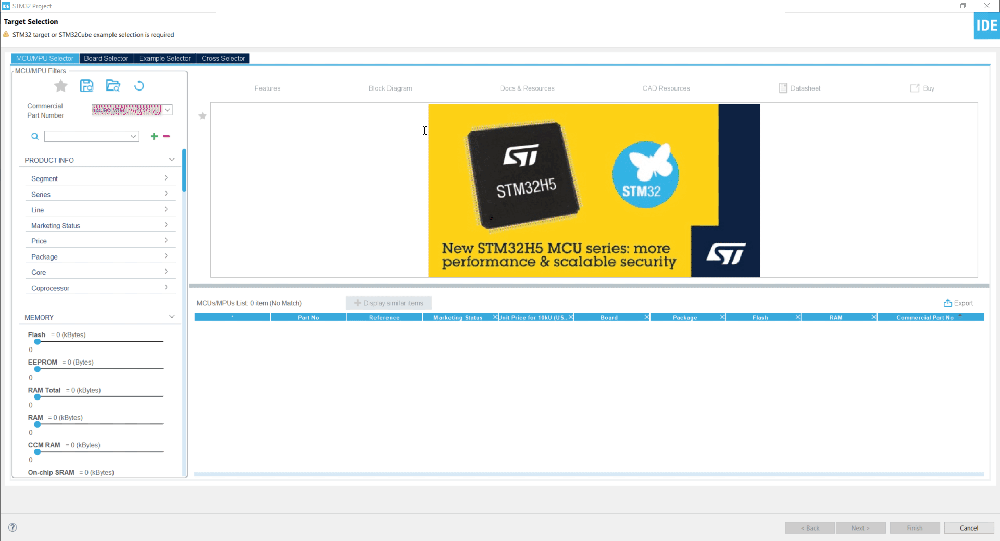
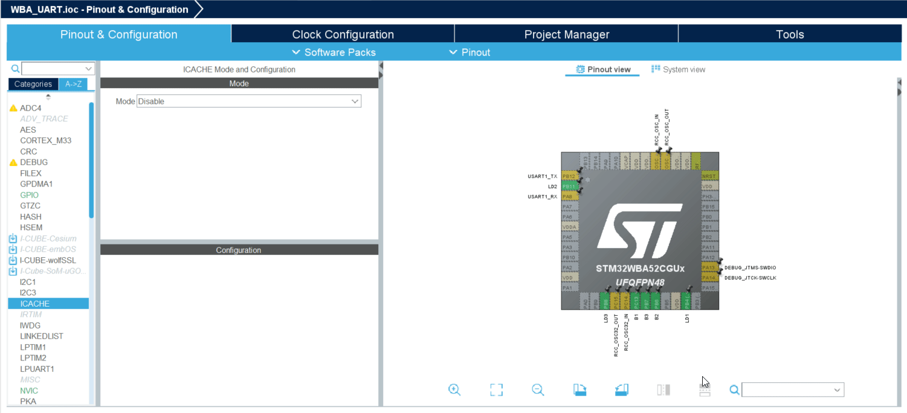
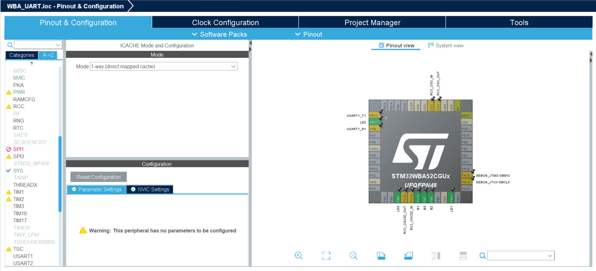
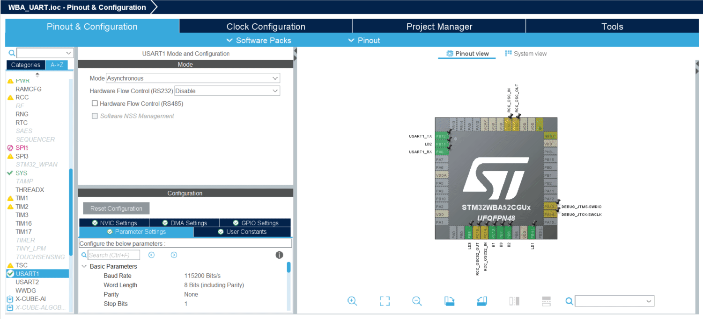
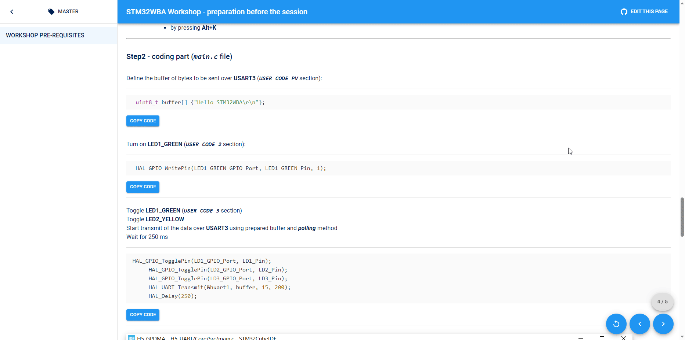
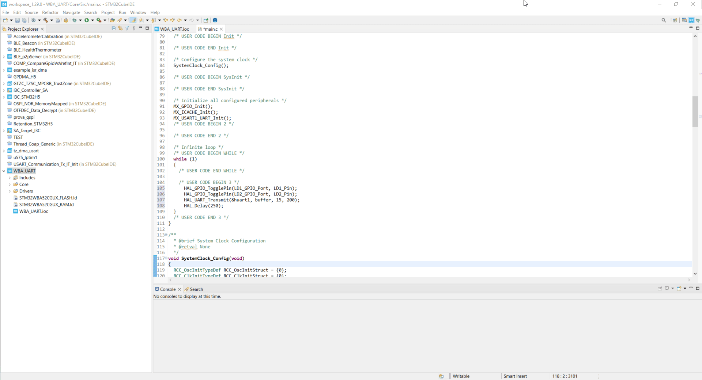

----!
Presentation
----!


# Prerequisites
- Hardware:
  - **PC with MS Windows 10 operating system and admin rights granted**
  - **1 USB A to Micro-B Cable** cable 
  <br>
  
  <br>
  - **[STM32WB5MM-DK](https://www.st.com/en/evaluation-tools/stm32wb5mm-dk.html)** Nucleo-64 development board.
  <br>
  
  <br>
- Software (PC with **MS Windows 10** operating system):
  - **[STM32CubeProg](https://www.st.com/en/development-tools/stm32cubeprog.html)** in version 2.15.0 or later
  - **[Virtual COM port drivers](https://www.st.com/en/development-tools/stsw-stm32102.html)**
  -  any **serial terminal** application (e.g. **[Termite](https://termite.software.informer.com/3.4/)**)


<br>

# Installation process
- download **STM32CubeProg** from [here](https://www.st.com/en/development-tools/stm32cubeprog.html)

<br>
----


# Verification process before the workshop
The purpose of this part is checking whether all software components are installed properly.
<br>
Additionally prepared test project can be a base for next hands-on parts during the workshop.

## **STM32CubeIDE and STM32WBA Cube library**
<br>

----

<br>
**Task definition**
<br>

- Using STM32CubeIDE
  - Enable SWD for debug
  - Disable TrustZone
  - Configure ICACHE (in any of available modes)
- Select and configure USART1
  - in asynchronous mode,
  - using default settings (115200bps, 8D, 1stop bit, no parity) 
  - on PA8/PB12 pins
<br>

----

<br>
## **Step1** - project creation and peripherals configuration
 - Run **STM32CubeIDE**
 - Specify workspace location (i.e. `C:\_Work\WBA_ex1`)

<br>
- Start new project using one of the below methods:
  - by selecting `File->New->STM32Project` 
  - by click on `Start new STM32 project` button
  <br>
  
<br>
- switch to **Board Selector** tab
- select **NUCLEO-WBA52CG** board
- press `Next` button
- within STM32 Project window:
  - specify project name (i.e. `WBA_UART`)
  - keep **enable TrustZone** option unchecked
  - press `Finish` button
  - on question pop-up window "Initialize all peripherals with their default state?" press `No` button 
  - on question pop-up window "Switch to proper CubeIDE perspective?", if it is showed, press `Yes` button 
  - on worning pop-up window "Do you still want a code generation?", press `No` button 
  - on following information pop-up window, it was our decision did not generate code, press `OK` button 
  <br>
   
<br>
- Peripherals configuration: Pinout&Configuration tab
- **ICACHE configuration** (System Core group)
  - select either 1-way or 2-ways (we will not focus on performance within this workshop)
  <br>
  
  <br>
- **USART1 configuration** (Connectivity group)
  - select Asynchronous mode
  - keep default settings in configuration:
    - Basic parameters: 115200bps, 8bits data, 1 stop bit, no parity
    - Pins assignment: PA8, PB12
    - no interrupts, no DMA usage
  <br>
    
<br>
- **Project settings**
  - select `Project Manager` tab
  - check project location (.ioc file)
  - check project name
<br>
   
<br>
  - generate project by one of the ways:
    - by pressing "gear" icon
    - by select `Project->Generate Code`
    - by pressing **Alt+K**

----

<br>
## **Step2** - coding part (`main.c` file)
<br>
Define the buffer of bytes to be sent over **USART3** (`USER CODE PV` section):
<br>

```c
  uint8_t buffer[]={"Hello STM32WBA\r\n"};
```

<br>
Turn on **LED1_GREEN** (`USER CODE 2` section):
<br>

```c
  HAL_GPIO_WritePin(LD1_GPIO_Port, LD1_Pin, 1);
```

<br>
Toggle **LED1_GREEN** (`USER CODE 3` section)
<br>
Toggle **LED2_YELLOW** 
<br>
Start transmit of the data over **USART3** using prepared buffer and ***polling*** method
<br>
Wait for 250 ms
<br>

```c
 HAL_GPIO_TogglePin(LD1_GPIO_Port, LD1_Pin);
    HAL_GPIO_TogglePin(LD2_GPIO_Port, LD2_Pin);
    HAL_GPIO_TogglePin(LD3_GPIO_Port, LD3_Pin);
    HAL_UART_Transmit(&huart1, buffer, 15, 200);
    HAL_Delay(250);
```

<br>

<br>

----

<br>
## **Step 3** - build the project
- Build the project using `hammer` button or `Project->Built All` or **Ctrl+B**
<br>

<br>

<ainfo>
In case of neither errors nor warnings after this process, STM32CubeIDE and STM32WBA library are installed correctly. Last point - debug session will be verified during first hands on part on the workshop.
</ainfo>


<ainfo>
## **Congratulations** You have completed installation part. Now you are fully prepared for the live workshop session. 
</ainfo>

----

# Materials for the session
- Access to tools dedicated web pages:
  - [STM32CubeIDE](https://www.st.com/en/development-tools/stm32cubeide.html)
  - [STM32CubeMX](https://www.st.com/en/development-tools/stm32cubemx.html)
  - [STM32WBA Cube library](https://www.st.com/en/embedded-software/stm32cubewba.html)
- [STM32 on-line training resources](https://www.st.com/content/st_com/en/support/learning/stm32-education/stm32-moocs.html)
- documentation
  - [STM32WBA52xx datasheet](https://www.st.com/resource/en/datasheet/stm32wba52ce.pdf)
  - [STM32WBA52xx reference manual](https://www.st.com/resource/en/reference_manual/rm0493-multiprotocol-wireless-bluetooth-lowenergy-armbased-32bit-mcu-stmicroelectronics.pdf)

