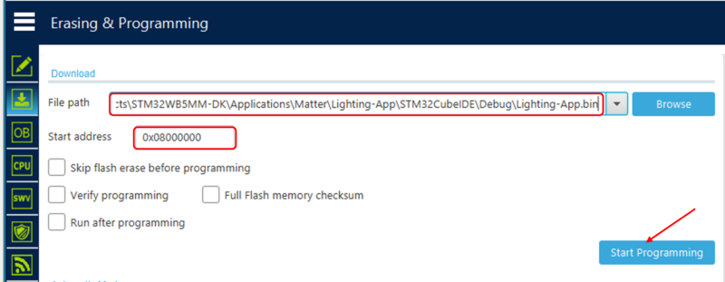

----!
Presentation
----!

# Prerequisites
- Hardware:
  - **PC with MS Windows 10 operating system and admin rights granted**
  - **1 USB A to Micro-B Cable** cable 
   
  
   
  - **[STM32WB5MM-DK](https://www.st.com/en/evaluation-tools/stm32wb5mm-dk.html)** Nucleo-64 development board.
   
  
   
- Software (PC with **MS Windows 10** operating system):
  - **[STM32CubeProg](https://www.st.com/en/development-tools/stm32cubeprog.html)** in version 2.15.0 or later
  - **[Virtual COM port drivers](https://www.st.com/en/development-tools/stsw-stm32102.html)**
  -  any **serial terminal** application (e.g. **[Termite](https://termite.software.informer.com/3.4/)**)

 

# Installation process
- download **STM32CubeProg** from [here](https://www.st.com/en/development-tools/stm32cubeprog.html)

- **Open the STM32CubeProgrammer version 2.15.0 or later.
- **Connect physically your development platform to the PC running STM32CubeProgrammer.
 
  
 
- **Connect your platform using STM32Cubeprogrammer.
 
  
 
----

# Update processor binary firmware stack
The Bluetooth® Low Energy-Thread Stack (stm32wb5x_BLE_Thread_ForMatter_fw.bin) for STM32WB5MM-DK, or the Thread stack for P-NUCLEO-WB55, can be updated in the same way as the FUS.
First, check the start address of the stack in the release notes within the X-CUBE-MATTER\Projects\STM32WB_Copro_Wireless_Binaries\STM32WB5x folder.

 
  
 

For STM32WB5MM-DK Discovery platform the recommended stack is: ...\Projects\STM32WB_Copro_Wireless_Binaries\STM32WB5x\stm32wb5x_BLE_Thread_ForMatter_fw.bin.
Check the First install checkbox if it is the first time you are installing the stack on your platform.

 
  
 

----

# Program M4 Core

All the code running on the Arm Cortex®-M4 on end device is delivered as source code and binaries for embedded application examples. If you want to use your own application, use STM32CubeIDE to build it for M4. Use STM32CubeProgrammer to flash M4 with application at the start address: 0x0800 0000.

 
  
 

----

# Materials for the session
- Access to tools dedicated web pages:
  - [STM32CubeIDE](https://www.st.com/en/development-tools/stm32cubeide.html)
  - [STM32CubeMX](https://www.st.com/en/development-tools/stm32cubemx.html)
  - [STM32WBA Cube library](https://www.st.com/en/embedded-software/stm32cubewba.html)
- [STM32 on-line training resources](https://www.st.com/content/st_com/en/support/learning/stm32-education/stm32-moocs.html)
- documentation
  - [STM32WBA52xx datasheet](https://www.st.com/resource/en/datasheet/stm32wba52ce.pdf)
  - [STM32WBA52xx reference manual](https://www.st.com/resource/en/reference_manual/rm0493-multiprotocol-wireless-bluetooth-lowenergy-armbased-32bit-mcu-stmicroelectronics.pdf)