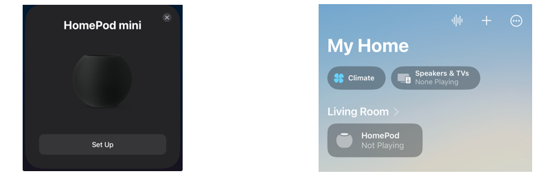
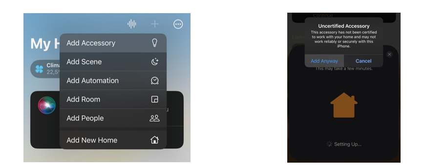
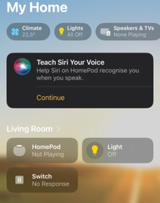
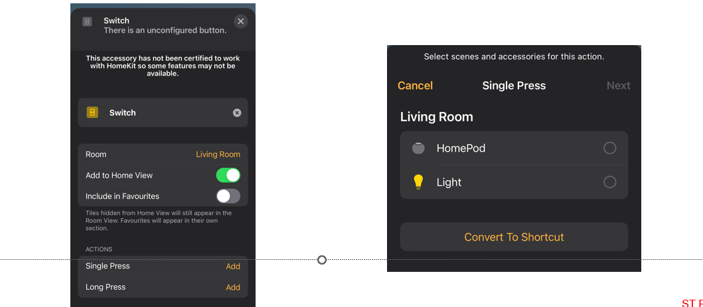
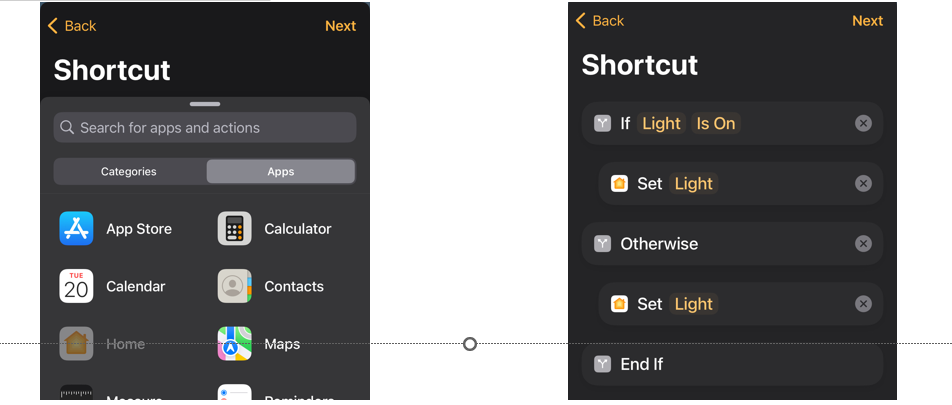

----!
Presentation
----!

# Commision HomePOD

HomePod needs to be pulsing with white light.
Bring phone close to HomePod or in Home app click on “Add Accessory” and “More options” and search for your HomePod.
Follow on-screen instructions, you can leave all the choices as default.
After commissioning, the device needs to finish its set-up – this is visible by the “Configuring” state. When “Not Playing” is shown, you can continue.

    
  
   

 

----

# Commision Device

Tap on the plus sign and “Add Accessory”.
Power on the STM32WB5M.
Scan the provided QR code, confirm “Add to Home”.
When asked if you want to add an uncertified accessory, confirm

    
  
   

Keep default “Location”, change name to reflect device type (e.g. Switch or Light).
After commissioning a switch, tap on the three dots icon and go to the Room where it was commissioned. Tap on the switch and enable “Add to Home View”. Go back to Home view.

   
  
   

----

# Bind switch to light

Tap on Switch and under “Actions / Single Press”, tap on “Add”.
Select “Convert to Shortcut”.

  
  
  

Slide up the menu available at the bottom, switch to “Apps” and choose “Home”.
Use the “If” and “Control” actions to set up the shortcut as shown here.
Tap on “Next” and “Done”.
 
  
  
