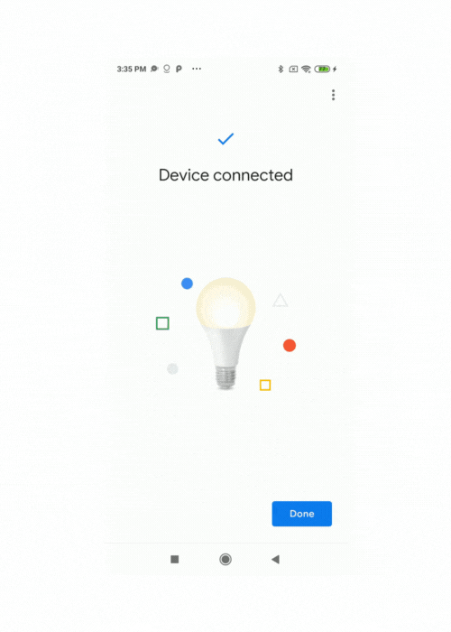

----!
Presentation
----!

# Let's open HomeKit app on the mobile provided to you

 

 

# Tap on + then Add Accessory
 

 

# Open the webcam and scan the QR CODE on OLED Display

 

 

# Matter device commissioning process starts

 

 

# Matter commissioning finished successfully

At the end of the commissioning, the STM32WB5MM-DK device is connected to the Matter network and the Fabric is created.

 

 

OLED display is showing the below output

 

 

 

# Control Matter End Node

First you need to provide a room on which device is located

 

 

Now the device is showed in device list and can be controlled

 

 

On the end device side, the received commands are displayed on the LCD screen which shows the message LED ON when the ON command is pressed, and update the light level when the level cluster is modified as follow:

 

 